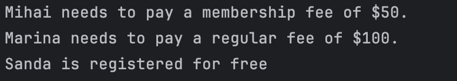

# Solid Principles


## Author: Grebennicova Ecaterina

----

## Objectives:

* Get familiar with the Solid Principles; 
* Choose 2 specific Solid letter; 
* Implement these 2 Solid letters in a simple project.

## Used Solid Principles:

* Single Responsibility Principle (SRP);
* Open/Closed Principle (OCP).


## Implementation

* The following implementation presents such Solip Principles as SRP and OCP. 
Using SRP we are introducing a User class that handles only user information in order to pay fees for working out at a gym, this includes name, age and type of membership. 

```
class User {
    constructor(name, age, membership) {
        this.name = name;
        this.age = age;
        this.membership = membership;
    }
}
```

* As OCP we have a base class named RegularFee, which represents a general fee structure which can be extended with subclasses like MembershipFee and FreeFee for different amounts of fees. 

```
class RegularFee {
    calculateFee() {
        return 100;
    }
}

class MembershipFee extends RegularFee {
    calculateFee() {
        return 50;
    }
}

class FreeFee extends RegularFee {
    calculateFee() {
        return 0;
    }
}
```

* After that we are using a GymRegistration class to register some potential users and determine which fee they have to apply.

```
class GymRegistration {
    register(user, feeStrategy = new RegularFee()) {
        const fee = feeStrategy.calculateFee();
        if (fee === 100) {
            console.log(`${user.name} needs to pay a regular fee of $${fee}.`);
        } else if (fee === 50) {
            console.log(`${user.name} needs to pay a membership fee of $${fee}.`);
        } else {
            console.log(`${user.name} is registered for free`);
        }
    }
}
```

## Conclusions / Screenshots / Results
* In conclusion, this laboratory work demonstrates effectively the usage of 2 Solid Principles, such as Single Responsibility Principle (SRP) and Open/Closed Principle (OCP). Implementing User class for user management information and RegularFee and its subclasses for different fee calculations strategies we got to create a clean and flexible code.

* The screenshot above provides us the behaviour of the code, where each user's fee is calculated according to the membership type as it is presented by the GymRegistration class. This presents us that the logic of the class is applied correctly for each type of user.