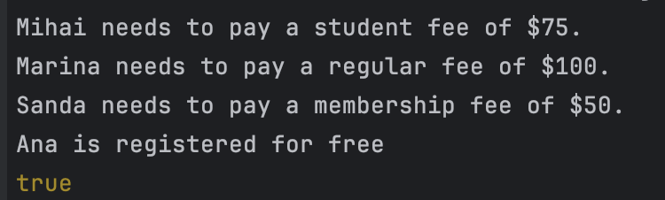

# Design Patterns


## Author: Grebennicova Ecaterina

----

## Objectives/Main tasks:

* Study and understand the Creational Design Patterns.
* Choose a domain area, define its main classes/models/entities and choose the appropriate instantiation mechanisms.
* Implement 3 creational design patterns for object instantiation in a sample project.

## Creational Design Patterns:

* Singleton Pattern;
* Factory Method Pattern;
* Prototype Pattern.


## Implementation

* The following implementation presents such Design Pattern as Singleton, Factory Method and Prototype Method.
  At the beginning we are introducing a User class that handles only user information in order to pay fees for working out at a gym, this includes name, age and type of membership. Using the method clone() we are creating a copy of this information.

```
class User {
    constructor(name, age, membership) {
        this.name = name;
        this.age = age;
        this.membership = membership;
    }
    
    clone() {
        return new User(this.name, this.age, this.membership);
    }
}
```
* Introducing Prototype pattern we are creating a prototype user and using clone() method we are copying the prototype, allowing creation of similar users with slight modifications.
```
const prototypeUser = new User('Default', 25, 'regular');
const user1 = prototypeUser.clone();
```

* By implementing a FeeDivision class based on the Factory Pattern we create a static method that takes as argument the membershipType of each member of the gym. Instead of manually creating objects in the class GymRegistartion, we are encapsulating the logic in FeeDivision  class and create additional fee classes based on the membership types. 
```
class FeeDivision {
    static createFee (membershipType) {
        switch (membershipType.toLowerCase()) {
            case 'student': return new StudentFee();
            case 'member' : return new MembershipFee();
            case 'guest' : return new FreeFee();
            default:
                return new RegularFee();
        }
    }
}
```

* We create an instance of a specific fee calculation (such as StudentFee, MembershipFee, FreeFee, or RegularFee) based on each user's membership type. After what we are calling calculateFee method to calculate the fee amount for each member.
```
 const feeStrategy = FeeDivision.createFee(user.membership);
 const fee = feeStrategy.calculateFee();
```

* As Singleton Pattern this constructor makes sure that there is an instance of GymRegistration. Any attempt to create a new instance will return the already existing instance, which means that only one object exists.
```
constructor() {
    if (GymRegistration.instance) {
        return GymRegistration.instance;
    }
    GymRegistration.instance = this;
}

static getInstance() {
    if (!GymRegistration.instance) {
        GymRegistration.instance = new GymRegistration();
    }
    return GymRegistration.instance;
}
```

## Conclusions / Screenshots / Results
* In conclusion, this laboratory work demonstrates effectively the usage of 3 design patterns, such as Singleton Pattern, Factory Method Pattern, Prototype Pattern. The Prototype Pattern allows the creation of a new user object by cloning a prototype user. The Factory Pattern is used in the class to dynamically the fee calculation based on membership type. And the Singleton Pattern ensure us that we create just a single instance of our class in our whole system. 
  
* Based on the screenshot provided above and on the behaviour of the code we succeed in managing user registration and fee calculation in a gym system.  