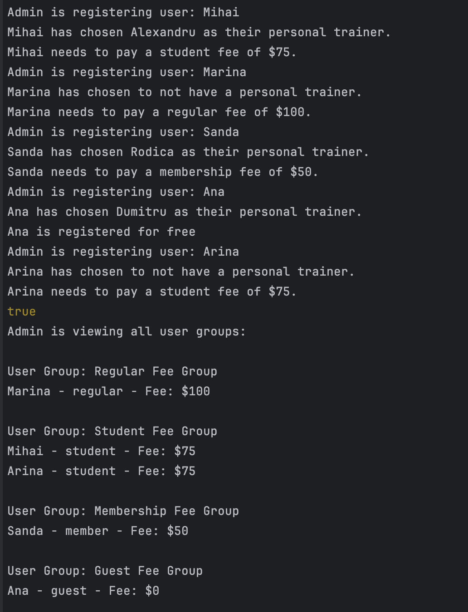

# Design Patterns


## Author: Grebennicova Ecaterina

----

## Objectives/Main tasks:

* Study and understand the Structural Design Patterns.
* Choose a domain area, define its main classes/models/entities and choose the appropriate instantiation mechanisms.
* Implement 3 structural design patterns for object instantiation in a sample project.

## Structural Design Patterns:

* Composite Pattern;
* Decorator Pattern;
* Proxy Pattern.


## Implementation

* The following implementation presents such Design Pattern as Composite, Decorator and Proxy.
  At the beginning we are introducing a Trainer class which acts as a decorator for User objects by adding additional functionality. The logic is about taking a trainer's name and display it for each user.
```
class Trainer {
    constructor(user, trainerName = null) {
        this.user = user;
        this.trainer = trainerName;
    }

    displayTrainerChoice() {
        if (this.trainer) {
            console.log(`${this.user.name} has chosen ${this.trainer} as their personal trainer.`);
        } else {
            console.log(`${this.user.name} has chosen to not have a personal trainer.`);
        }
    }
}
```

* Introducing Composite pattern we are organizing users in different into different components, individual and the group ones. 
* This makes the UserIndivid represent the Leaf component, individual users
```
class UserIndivid extends UserComponent {
    constructor(user) {
        super();
        this.user = user;
    }

    getDetails() {
        return `${this.user.name} - ${this.user.membership} - Fee: $${this.user.fee}`;
    }
}
```
* And makes the UserGroup represent the Composite component, group of users
```
class UserGroup extends UserComponent {
    constructor(feeType) {
        super();
        this.feeType = feeType;
        this.users = [];
    }

    add(userComponent) {
        this.users.push(userComponent);
    }

    getDetails() {
        console.log(`\nUser Group: ${this.feeType}`);
        this.users.forEach(user => {
            console.log(user.getDetails());
        });
    }
}
```
* All these are based on the abstract component, the UserComponent class which serves as a component interface  
```
class UserComponent {
    add(userComponent) {
        throw new Error("This method must be implemented.");
    }

    getDetails() {
        throw new Error("This method must be implemented.");
    }
}
```
* The last one implemented is the Proxy pattern which controls the access to another object based on some restrictions. This way, based on the flag the person/admin is allowed to register and display user of the gym.
```
class GymRegistrationProxy {
    constructor(isAdmin) {
        this.isAdmin = isAdmin;
        this.gymRegistration = GymRegistration.getInstance();
    }

    register(user, trainerName = null) {
        if (this.isAdmin) {
            this.gymRegistration.register(user, trainerName);
            console.log(`Admin is registering user: ${user.name}`);
        } else {
            console.log("Access denied: Only admins can register new users.");
        }
    }

    displayAllUsers() {
        if (this.isAdmin) {
            this.gymRegistration.displayAllUsers();
            console.log("Admin is viewing all user groups:");
        } else {
            console.log("Access denied: Only admins can view all users.");
        }
    }
}
```

## Conclusions / Screenshots / Results
* In conclusion, this laboratory work demonstrates effectively the usage of 3 structural patterns, such as Composite Pattern, Decorator Pattern, Proxy Pattern. The Composite Pattern allows the organization of users in individual and group components, allowing simplified addition of new groups and members of gym in general. The Decorator Pattern is used in the class to add to the user object an additional behaviour. And the Proxy Pattern ensure us that only concrete users receive access to data control, such as registering a reviewing users list. 
  
* Based on the screenshot provided above and on the behaviour of the code we succeed in managing user registration and their display based on membership types in a gym system.  