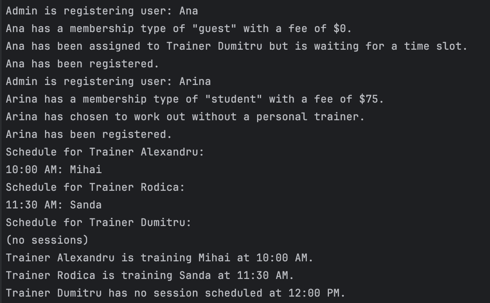

# Design Patterns


## Author: Grebennicova Ecaterina

----

## Objectives/Main tasks:

* Study and understand the Behavioral Design Patterns.
* As a continuation of the previous laboratory work, think about what communication between software entities might be involed in the system.
* Choose a domain area, define its main classes/models/entities and choose the appropriate instantiation mechanisms.
* Implement at last 1 behavioral design pattern for object instantiation in the project.

## Structural Design Patterns:

* Mediator Pattern

## Implementation

* The following implementation presents such as Mediator.
  The following class was created in the system, in order to act central hub through which all interactions are made, between trainers, users, and gym registration.
```
    registerGym(gymRegistration) {
        this.gymRegistration = gymRegistration;
    }

    registerTrainer(name, trainer) {
        this.trainers[name] = trainer;
    }
```
* This method bellow allows to assign a concrete trainer to a user. If there is no trainerName than the person chose to workout independently, 
  but if the trainer exists then the task of assignment is sent to the assignUser method from the Trainer class.
```
    assignTrainer(user, trainerName, timeSlot = null) {
        if (!trainerName) {
            console.log(`${user.name} has chosen to work out without a personal trainer.`);
            return;
        }

        const trainer = this.trainers[trainerName];
        if (trainer) {
            trainer.assignUser(user, timeSlot);
        } else {
            console.log(`Trainer ${trainerName} is not available.`);
        }
    }
```
* The trainer class was as well slightly modified in order for it to work concrete as a Decorator pattern. Now we observe
  that in the context of decorating it adds to the user's behavior some additional functionality, in our case scheduling and training sessions.
  The assignUser method gives the possibility to a user to schedule the training session to a specific time with a specific trainer.

```
    assignUser(user, timeSlot = null) {
        if (timeSlot) {
            if (!this.schedule[timeSlot]) {
                this.schedule[timeSlot] = user;
                console.log(`${user.name} has been assigned to Trainer ${this.name} at ${timeSlot}.`);
            } else {
                console.log(`Time slot ${timeSlot} is already booked for Trainer ${this.name}.`);
            }
        } else {
            console.log(`${user.name} has been assigned to Trainer ${this.name} but is waiting for a time slot.`);
        }
    }
```

## Conclusions / Screenshots / Results
* In conclusion, this laboratory work demonstrates effectively the usage of the chosen behavioral pattern - Mediator Pattern and the changes implemented into the Decorator Pattern.
  The Mediator Pattern facilitates communication between trainers, users, and the gym registration system controlling the whole idea of their interactions. This pattern ensures loose coupling between components, making the system more understandable. 
  Changes to the Decorator Pattern were introduced to extend the user object with additional functionality, such as assigning trainers and managing schedules dynamically. 
  
* Based on the screenshot provided above and on the behaviour of the code we succeed in managing user registration, their workout trainer and chosen time slot for the session in a gym system.  